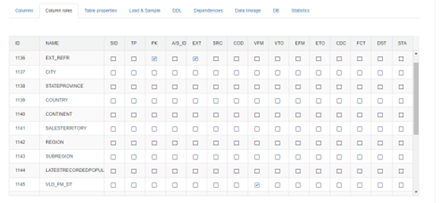
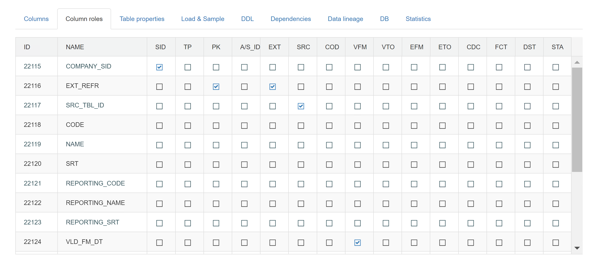

## Column roles

For each target table, we need to define columns roles. These are divided in technical and content fields- we only need to define roles for the first. These roles are global, but we can override them in every mapping- theoretically, we can leave roles settings empty in global catalog and define them in mapping, where we use this target table.

It is mandatory to define column roles if table will be used as lookup table. If column roles will not be set, lookup to this table will not be possible. EXT_REFR field needs to have PK and EXT checked.

