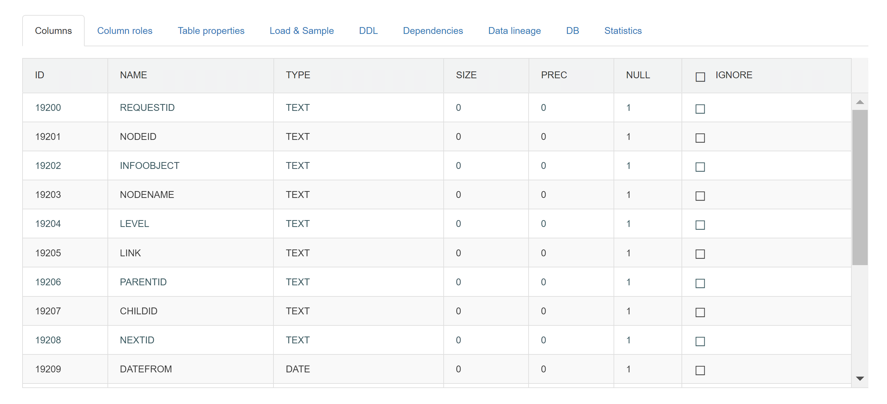

## Columns

List of all columns present in a table. You can see theirs types, size and precision. 
For each column you can select IGNORE flag. It will be applied only on source tables, when extraction SQL is generated. It is used to filter out columns, we won’t need in our ETL process, mainly when those columns are big in size (ex. BINARY) or column type in source database specific (ex. GEOGRAPHY in MS SQL). 
When finished, click UPDATE button. Recreating EX and V_EX steps are mandatory, when we edit data in this tab. We will dig into ETL steps in chapters ahead.

