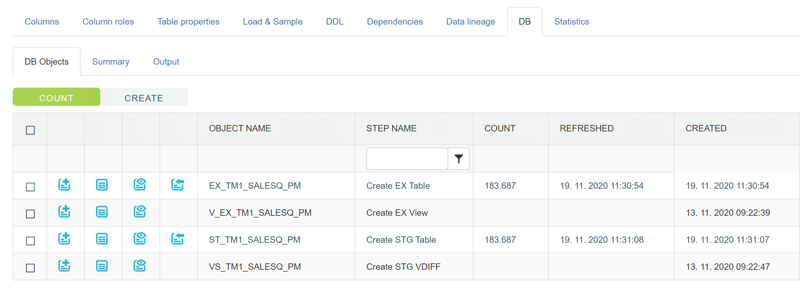

## DB

All ETL steps or objects if you like, regarding selected table, are listed in this tab. Same list can be found in each mapping, where it shows all steps needed to load one target table.
Note that in catalog section, DB tab is important only for source tables, because data flow is generated automatically - usually it goes from source database to the extract table on target database and from there on to the stage table. For target tables (dimension, fact etc.), data flow must be defined by the user, based on mapping he creates.

If we look at the steps, we have:
*	EX_: Creates extract table for corresponding source table.
*	V_EX_: Deploys extract SQL query to the target database, where execution engine can use it to load data from source to extract table.
*	ST_: Creates stage table for corresponding source table. Stage tables are always a full picture of a source system, with couple of additional technical fields.
*	VS_: Creates view, that serves as a comparison between extract and stage tables.

Different actions we can use for each step:
*	CREATE: Each step can be recreated. It is necessary to do so, when we are changing data, that reflects in different extract and stage tables.
*	DDL: We can always generate a DDL for each object or step.
*	PREVIEW DATA: Preview data, that certain object contains of.
*	LOAD DATA: Starts execution engine, that loads data into selected object.

Above list, SUMMARY and OUTPUT tabs can be seen. These are intended for a user to see the result of a certain action.
