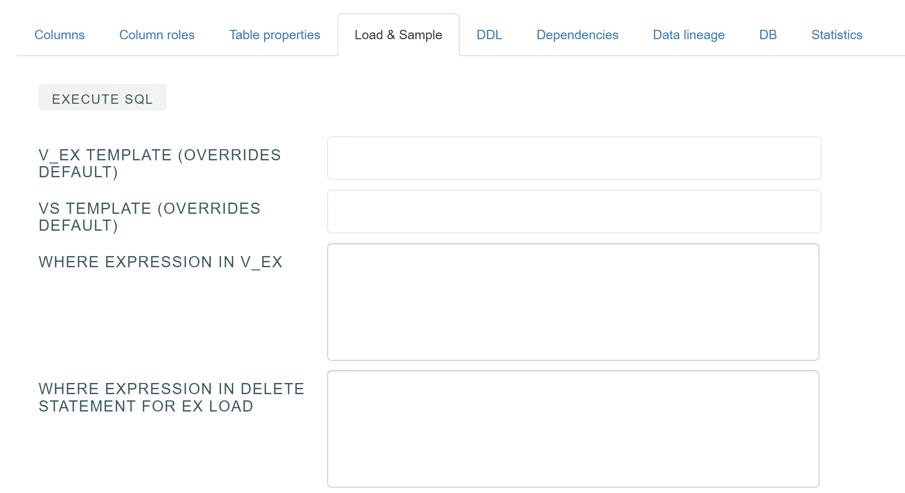
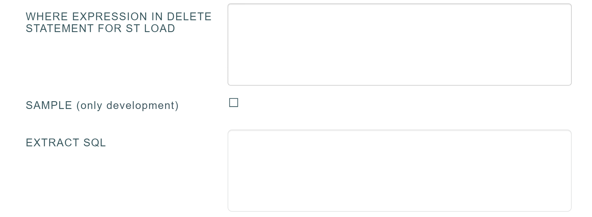
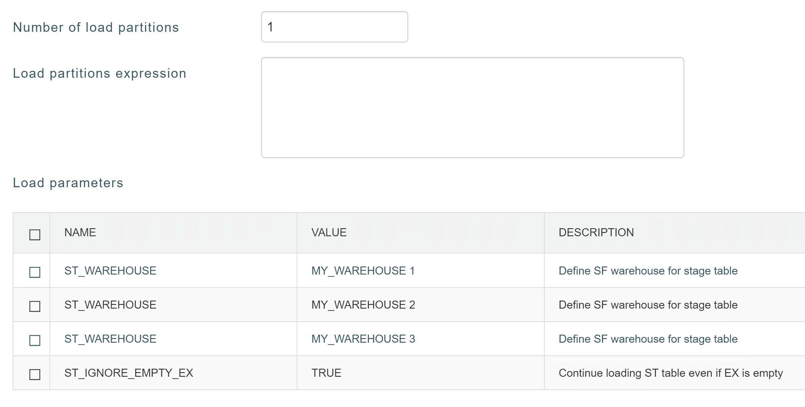
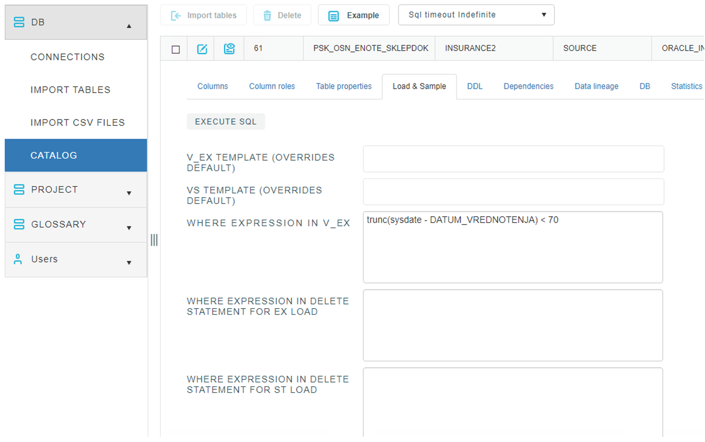
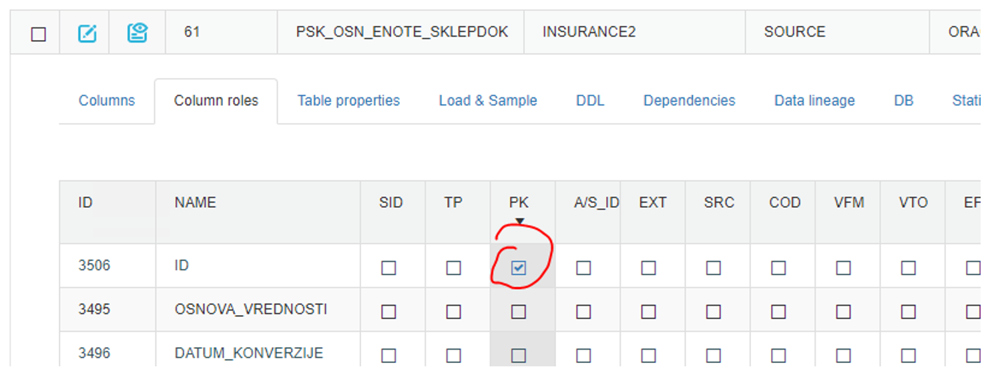

## Load and sample

Load & Sample enables that we can filer data from source table.
In EXTRACT SQL, we can define NEW query to read from source table. We can select just some columns, or we can rename some…
In Number of load partitions window, we can set number of partitions, which will define numbers of paroral loading. To use partition loading, define DST fields In Columns roles tab is mandatory. 

## Incremental load EX and ST

### 1. V_EX WHERE expression and PPN_GID is determined

**PPN_GID**

**EX**

TRUNCATE TABLE EX.EX_ORA_INS2_PSK_OSN_ENOTE_SKLEPDOK;  
"INSERT INTO FROM EX.EX_ORA_INS2_MET_NASLOV"  
SELECT * , NVL(CAST(ID AS VARCHAR(50)), 'XX') as PPN_GID  
FROM INSURANCE2."PSK_OSN_ENOTE_SKLEPDOK"  
WHERE trunc(sysdate - DATUM_VREDNOTENJA) < 70;  

**ST**

DELETE FROM ST.ST_ORA_INS2_PSK_OSN_ENOTE_SKLEPDOK  
WHERE PPN_GID IN (SELECT PPN_GID FROM VS_ORA_INS2_PSK_OSN_ENOTE_SKLEPDOK); 
INSERT INTO ST.ST_ORA_INS2_PSK_OSN_ENOTE_SKLEPDOK  
SELECT * FROM ST.VS_ORA_INS2_PSK_OSN_ENOTE_SKLEPDOK;

