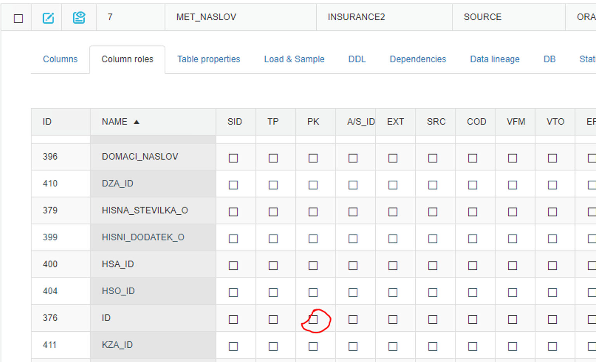

## Load and sample

Load & Sample enables that we can filter data from source table.
In EXTRACT SQL, we can define NEW query to read from source table. We can select just some columns, or we can rename some…
In Number of load partitions window, we can set number of partitions, which will define numbers of parallel loading. To use partition loading, define DST fields In Columns roles tab is mandatory. 


## Incremental load EX and ST

### 1. V_EX WHERE expression and PPN_GID is defined


**PPN_GID**


**EX**

```sql
TRUNCATE TABLE EX.EX_ORA_INS2_PSK_OSN_ENOTE_SKLEPDOK;
"INSERT INTO FROM EX.EX_ORA_INS2_MET_NASLOV"
SELECT * , NVL(CAST(ID AS VARCHAR(50)), 'XX') as PPN_GID 
FROM INSURANCE2."PSK_OSN_ENOTE_SKLEPDOK" 
WHERE trunc(sysdate - DATUM_VREDNOTENJA) < 70; 
```


**ST**
```sql
DELETE FROM ST.ST_ORA_INS2_PSK_OSN_ENOTE_SKLEPDOK 
WHERE PPN_GID IN (SELECT PPN_GID FROM VS_ORA_INS2_PSK_OSN_ENOTE_SKLEPDOK);
INSERT INTO ST.ST_ORA_INS2_PSK_OSN_ENOTE_SKLEPDOK
SELECT * FROM ST.VS_ORA_INS2_PSK_OSN_ENOTE_SKLEPDOK;
```

### 2. V_EX WHERE expression, DELETE WHERE in EX_LOAD and PPN_GID is defined


**V_EX**

```sql
SELECT 
  ID
, ...
, STANOVANJE
--, 'XX' as PPN_HASH
, NVL(CAST(ID AS VARCHAR(50)), 'XX') as PPN_GID
FROM INSURANCE2."MET_NASLOV"
```

**EX**

```sql
DELETE FROM EX.EX_ORA_INS2_MET_NASLOV WHERE 2=2;
"INSERT INTO FROM EX.EX_ORA_INS2_MET_NASLOV"
SELECT * , NVL(CAST(ID AS VARCHAR(50)), 'XX') as PPN_GID
FROM INSURANCE2."MET_NASLOV"
WHERE 1=1;
```

**ST**

```sql
DELETE FROM ST.ST_ORA_INS2_MET_NASLOV 
WHERE PPN_GID IN (SELECT PPN_GID FROM VS_ORA_INS2_MET_NASLOV);
INSERT INTO ST.ST_ORA_INS2_MET_NASLOV SELECT * FROM ST.VS_ORA_INS2_MET_NASLOV;
```

### 3. V_EX WHERE expression, PPN_GID isn't defined




**V_EX**

```sql
SELECT 
  ID
...
, STANOVANJE
--, 'XX' as PPN_HASH
, 'XX' as PPN_GID
FROM INSURANCE2."MET_NASLOV"
```

**EX**

```sql
TRUNCATE TABLE EX.EX_ORA_INS2_MET_NASLOV;
INSERT INTO FROM EX.EX_ORA_INS2_MET_NASLOV
SELECT 
...
, STANOVANJE
, 'XX' as PPN_GID
FROM INSURANCE2."MET_NASLOV"
WHERE 1=1;
```
**ST**

```sql
-- Tole je načeloma problem, ker GID ni določen!
DELETE FROM ST.ST_ORA_INS2_MET_NASLOV WHERE PPN_GID IN (SELECT PPN_GID FROM VS_ORA_INS2_MET_NASLOV); 
INSERT INTO ST.ST_ORA_INS2_MET_NASLOV SELECT * FROM ST.VS_ORA_INS2_MET_NASLOV 
```
### 4. V_EX WHERE expression, PPN_GID isn't defined and WHERE for ST LOAD


**V_EX**

```sql
SELECT 
  ID
...
, STANOVANJE
--, 'XX' as PPN_HASH
, 'XX' as PPN_GID
FROM INSURANCE2."MET_NASLOV"
```

**EX**

```sql
TRUNCATE TABLE EX.EX_ORA_INS2_MET_NASLOV;
INSERT INTO FROM EX.EX_ORA_INS2_MET_NASLOV
SELECT 
...
, STANOVANJE
, 'XX' as PPN_GID
FROM INSURANCE2."MET_NASLOV"
WHERE 1=1;
```
**ST**

```sql
DELETE FROM ST.ST_ORA_INS2_MET_NASLOV WHERE 3=3;
INSERT INTO ST.ST_ORA_INS2_MET_NASLOV SELECT * FROM ST.VS_ORA_INS2_MET_NASLOV;
```
