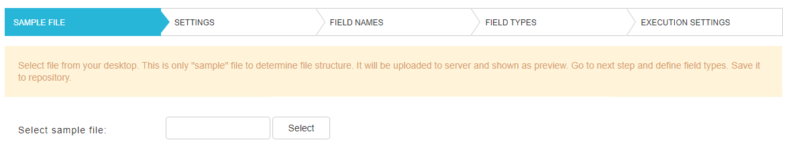
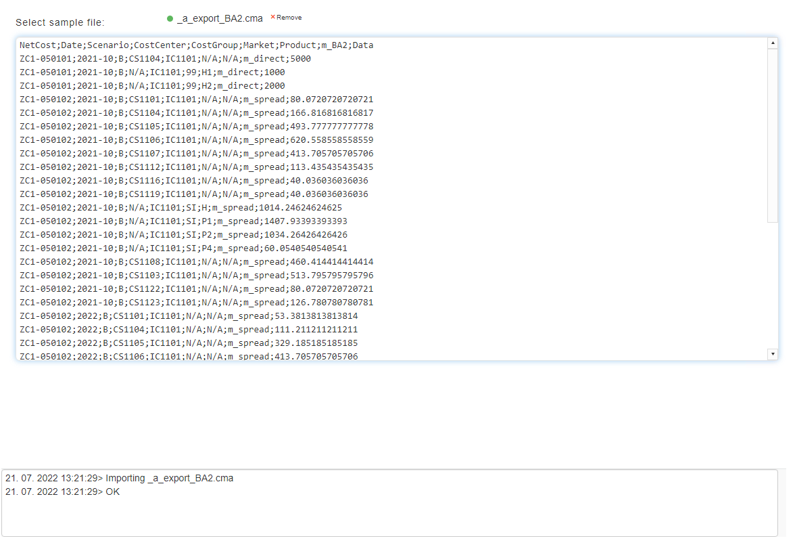
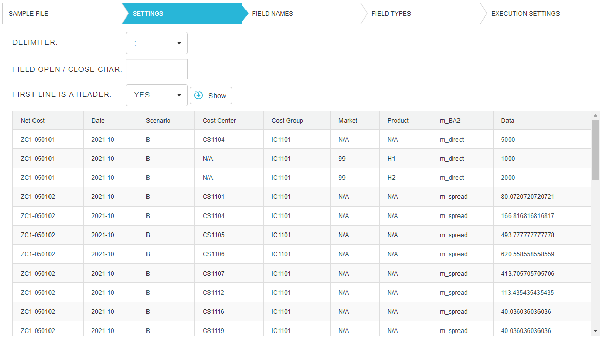
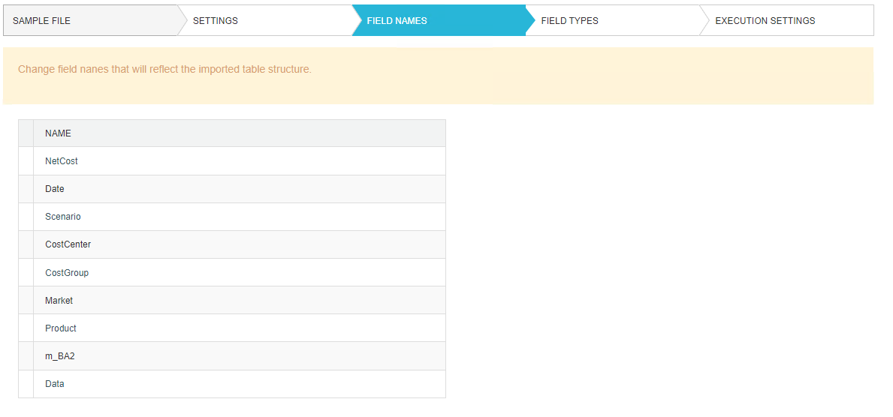
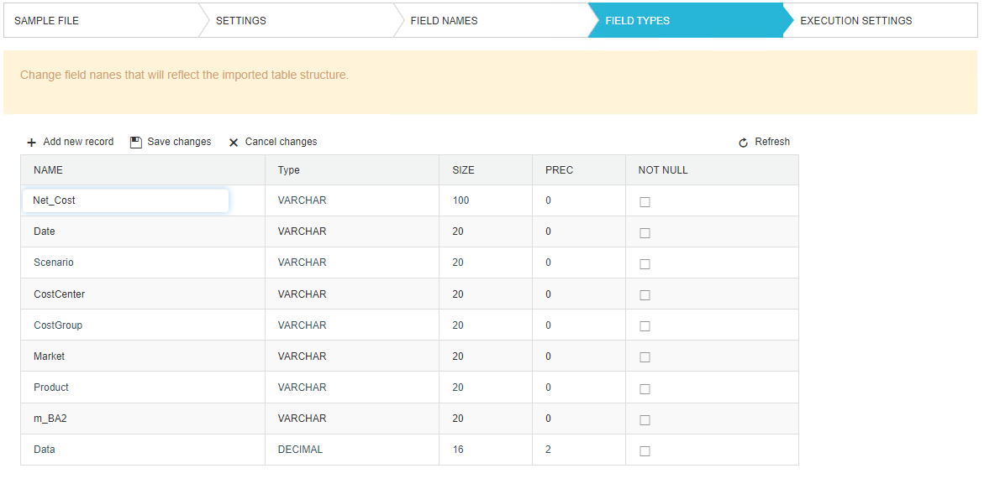
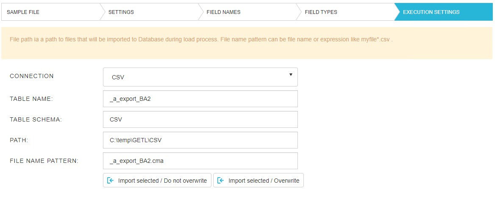
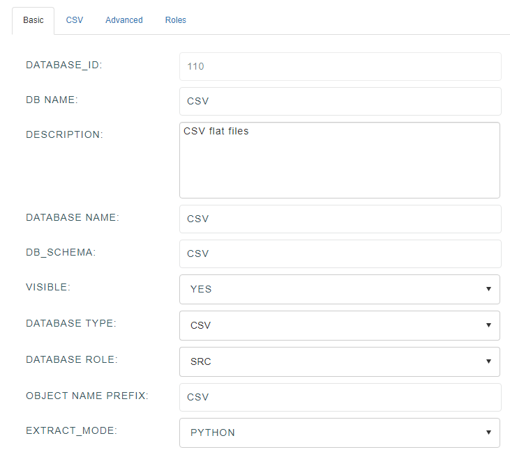
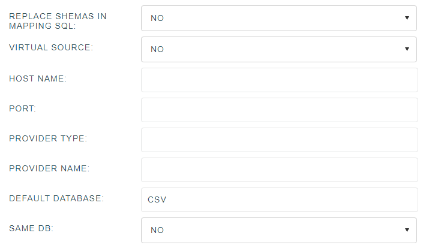
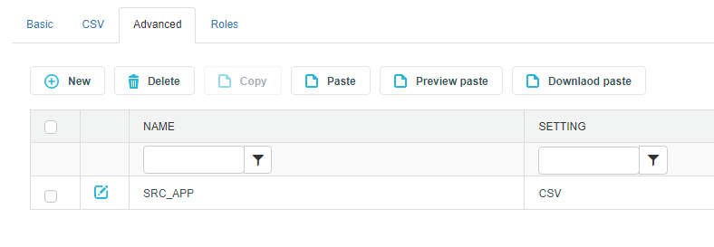

# Import CSV files

## Sample file

Data Merlin treats CSV files as source tables. To import one, click on select button, select a file from the file system and click open.

File content is previewed and we get a message that the file was imported.

## Settings

In the setting tab we select an appropriate delimiter, field open/close character and whether the first line of the file is a header or not. Then we click show.

## Field names

We can also rename the columns by clicking on them and typing in a new name.

## Field types

In field types we have the option to adjust column properties, by clicking on them and then changing the content. Finally we click save changes to apply our updates or cancel changes to discard them.

## Executiom settings

Most fields here will be auto filled and we can change them before the table import. We recommend that the table schema is *CSV* and that you choose the *CSV* connection. If you don not have one yet, go to connection and create it. We provide the template below.

## CSV connection

A template for CSV connection that should be used for CSV files.

