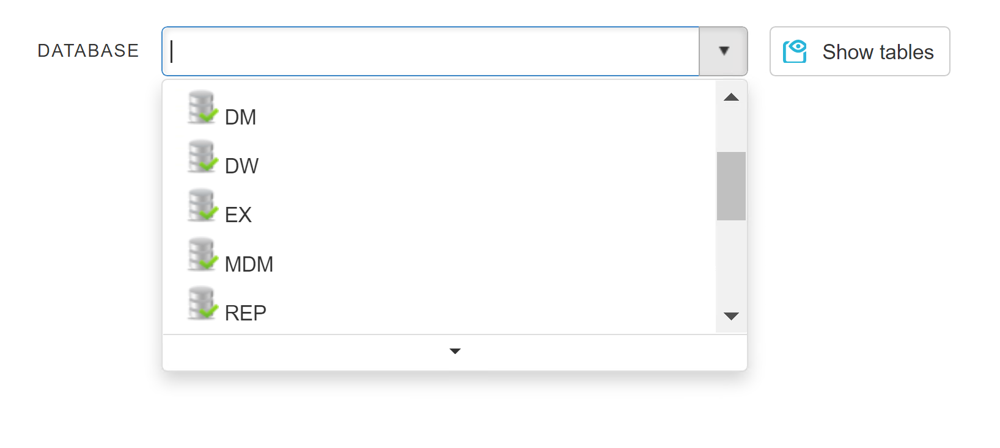
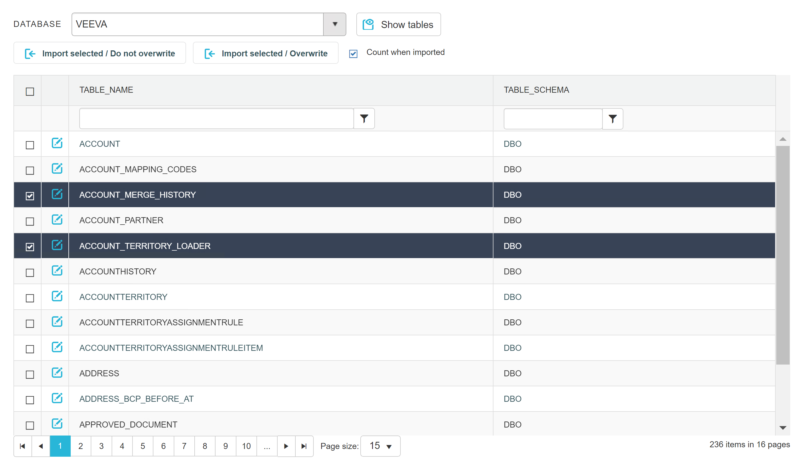

# Import tables

In order for Data Merlin to gain its automation capabilities, we must define metadata of our source and target tables, but first we must import them to the catalog. Most of the time only target tables need to be imported manually, while source tables are found and imported automatically, based on parsed mapping SQL.

* Select database connection, from which you want to import one or more tables. After that, list of tables will be populated.

* In tables list, select ones you want to import and click appropriate import button- 'Do not overwrite' means table import will be skipped for those already present in the catalog.

