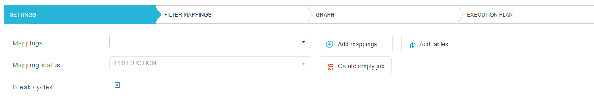

# New load on demand

First we select the mappings that we want to include in the load by clicking *Add mappings*. Note that only mappings with status *PRODUCTION* will appear on the list. By adding a mapping into a load we will also be adding all dependent tables (EX, ST) automatically. 

Additonaly we have the option to add individual tables that might not be a part of any mapping, by clicking *Add tables*. 

*Create empty job* button creates a new empty job. This can be used when we only want to execute a certain pre or post action without loading any tables.

