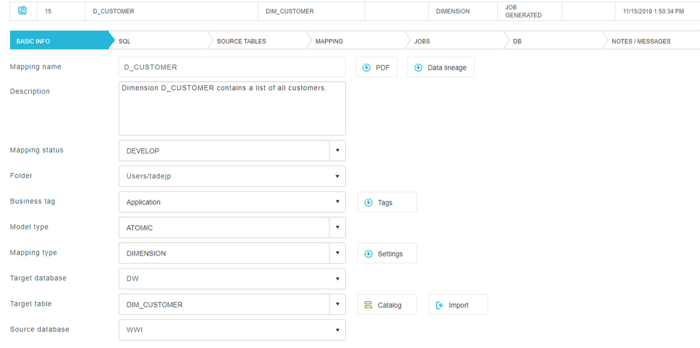
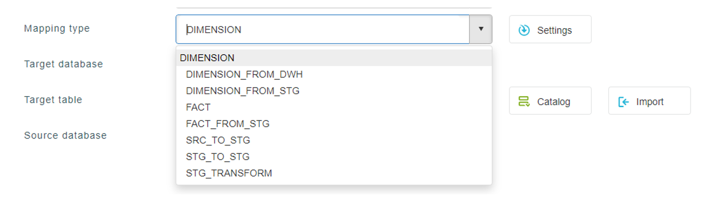

## Basic info

#### 1. Mapping name

Unique mapping name. Usually derived from a target table name.

#### 2. Description

Mapping description.

#### 3. Mapping status

Indicates in which status current mapping is. It can be set manually. Statuses like DEVELOP and TEST are just an information and they don’t influence the mapping, while PRODUCTION status disables an UPDATE button for all users except admin. This status can be set automatically, after you generate a deploy script for a certain mapping. This is option is helpful for maintaining consistency among development and production environments, when changes can be performed only when mapping is moved out of the production status.

#### 4. Folder

This attribute helps us to organize our mappings into folder tree structure. User folders are created automatically for each use we create, while rest of the structure can be managed in “List of mappings” form, with selecting “Folders” button. More on that is written in above section.

#### 5. Business tag

We can set different tags to our mappings, which can be later used in “List of mappings” to filter on desired tags. Multiple tags can be selected when filtering.

#### 6. Model type

#### 7. Mapping type

Most important attribute in basic info is mapping type. Different methodology is used in background, based on that option. We can add and implement our own custom mapping type or edit existing one- depends on target database model we are using.

**For dimensions:**  
DIMENSION – read from source
DIMENSION_COMPARE_FLDS - field compare instead of hash compare 
DIMENSION_FROM_DWH – read from DWH
DIMENSION_FROM_STG - read from ST
DIMENSION_OPEN_DELETE –Not closing record - all records are open.   
DIMENSION_PLAIN - talking SID (no sequence) 

**For facts:**  
FACT - read from source
FACT_FROM_STG - read from ST

**For ST tables:**  
MERGE – fore MERGE table
STG_TO_STG - read from ST and write to ST table 
SRC_TO_STG - read from source, write to ST table

#### 8. Target databse

As a name suggest, target database selected here.

#### 9. Target table

Just like database, target table is selected as well.

#### 10. Source database

It defines which source connection should be default, while we can use many different source connections in one mapping- we call that a FADARATED QUERY. Main advantage is, that for default connection, we don’t need to write the whole path of tables every time in our mapping SQL, but can simply define table name and schema if needed, while for other connections, we need to define connection first, than schema and table name at the end, for example: MY_SRC_CONN.dbo.MY_TABLE.
