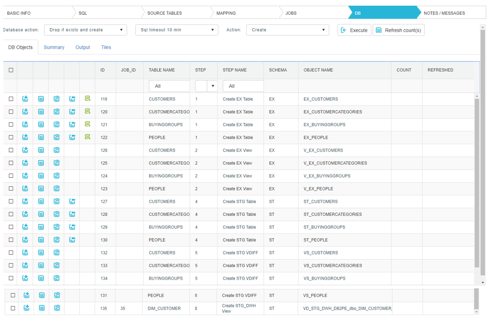

### DB

In DB tab, all steps, necessary for loading one target table, are listed. All steps, except the last one, are created when a ‘Generate fields’ button is clicked in SQL tab. Last step however is created when a ‘Create new job’ button is clicked in JOBS tab.
First, let’s break down this list, by STEP NAME:

*	Create EX Table: These steps create extract tables.
*	Create EX View: Though a name suggests, that view is created, in reality only extract SQL is generated and sent to target database, where execution engine use it to extract data from source to extract table. Extract can be initial or with increment.
*	Create STG Table: Creates a stage table, which is full picture of a source system. That means that stage table should have the same content and rows count as a corresponding source table- with few additional technical fields.
*	Create STG VDIFF: Creates a view, where differences between extract and stage table are being found. Based on select from that view, execution engine knows what needs to be inserted, deleted or updated.
*	Create STG_DWH View: Similar to STG  VDIFF, STG_DWH View analyses differences between stage and target tables (DWH).

Operations on individual steps:
*	Create: Creates or recreates step.
*	DDL: DDL for each step can be generated.
*	Preview data: Shows a data preview for table or view.
*	Load: Some steps also have a load option, where you can test your mapping on the fly with a real data.
