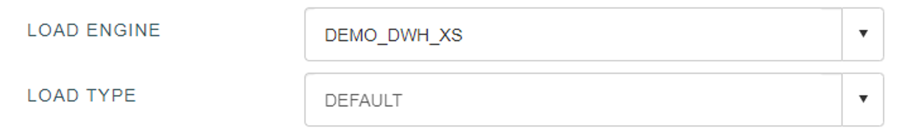

### Jobs

When we have set everything Data Merlin needs, it is time to generate a job, which the execution engine will use. This is done in two steps:
Click on a ‘Validate job’ button and if result is like in example below, you are good to go. In case of errors, list will be populated with them- they are warnings and fatal errors. If any of the fatal errors occurs, a ‘Create new job’ button will be disabled, so first make sure you don’t have any of them.

After a successful validation, you are now able to create a job, by clicking a ‘Create new job’ button. Job should appear in the list and you can perform following operations on it: 

*	Recreate: When mapping is already created, you don’t have to repeat that operation, but just select ‘Recreate’ option.
*	Edit: If using Snowflake as a target database, ‘Load engine’ can be selected for every job, what is called ‘Warehouse’ in Snowflake.

*	Delete: Delete a job.
*	Deploy job: DOPOLNI
