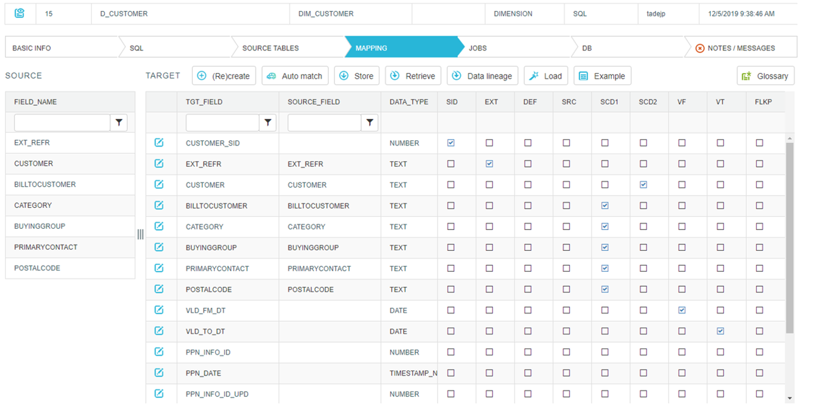
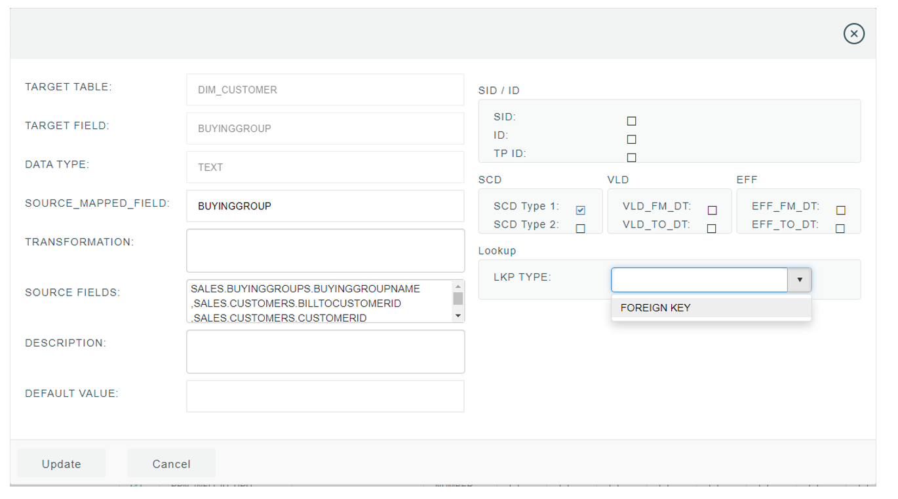

## Mapping

So, our mapping SQL is parsed, Data Merlin gained information about source tables needed and what fields a query result contains. On the other side we have our target model and its tables imported into Data Merlin Catalog. What is left is to define, to which target field a certain source field should be bound to. This is done by dragging desired source fields from left side, to the target field on the right.
Note that at the beginning, right list will be empty and only source fields will be visible. To fill out target fields, you must click a ‘(Re)create’ button. This is also necessary, when change in target table structure occurs- it brings new structure to the target list.

#### 1. Value lookup

When developing a mapping for a fact table, you will most probably need to implement lookups on dimensions. You shouldn’t do it in your mapping SQL, while Data Merlin have a special functionality built-in, where left joins on lookup tables are generated automatically. You just need to define an input field (from parsed mapping SQL) by simply drag and drop it from left to the right side and add FLKP flag on that mapping line. Finally, define a lookup table, by selecting an ‘Edit’ button on that mapping line. A form will open, where you simply set LKP TYPE to a FOREIGN KEY- example is shown on picture below.

