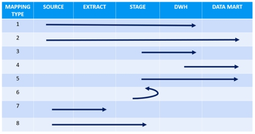

## MAPPINGS

Mapping is a central object for Data Merlin’s ETL automation process. Each of them contains a complete blueprint to load one target table. 
Process consist of three main steps:

1.	Select data from source, using SQL query
2.	Define fields selected from source to target fields
3.	Generate job

It should be noted, that multiple mappings can load data into one target table. Data flow starts with source table and ends with target table- both can be located anywhere in our system. They can even be at the same location, for example when we want to fill a dimension, with an aggregated data from another dimension. In that case, both tables are in target model.
In picture below, some of the possibilities are presented:

