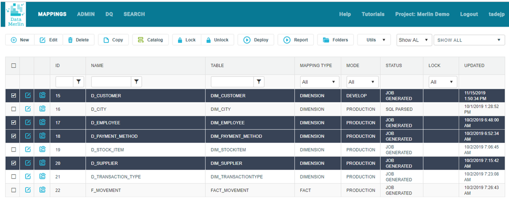
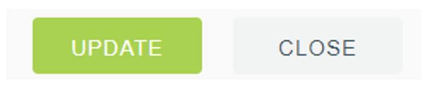
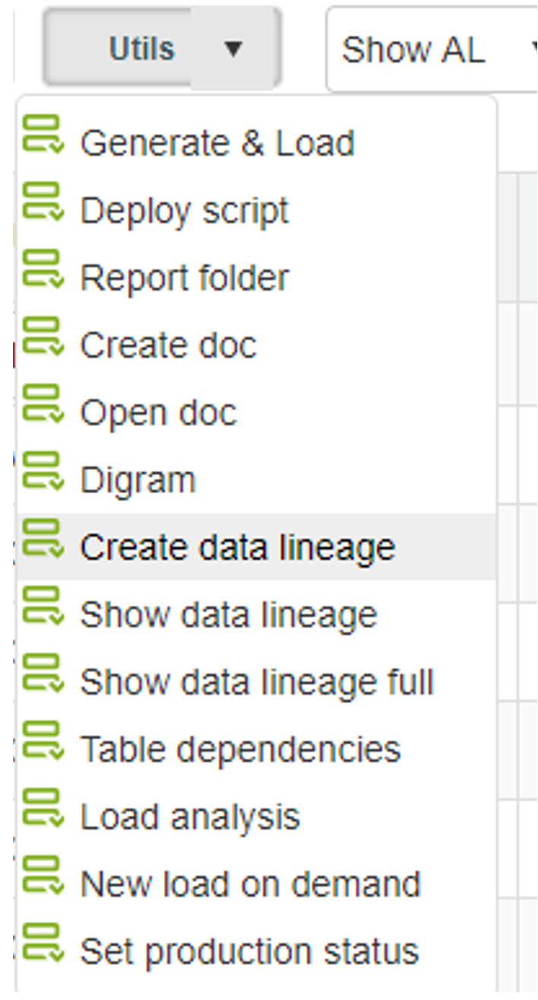
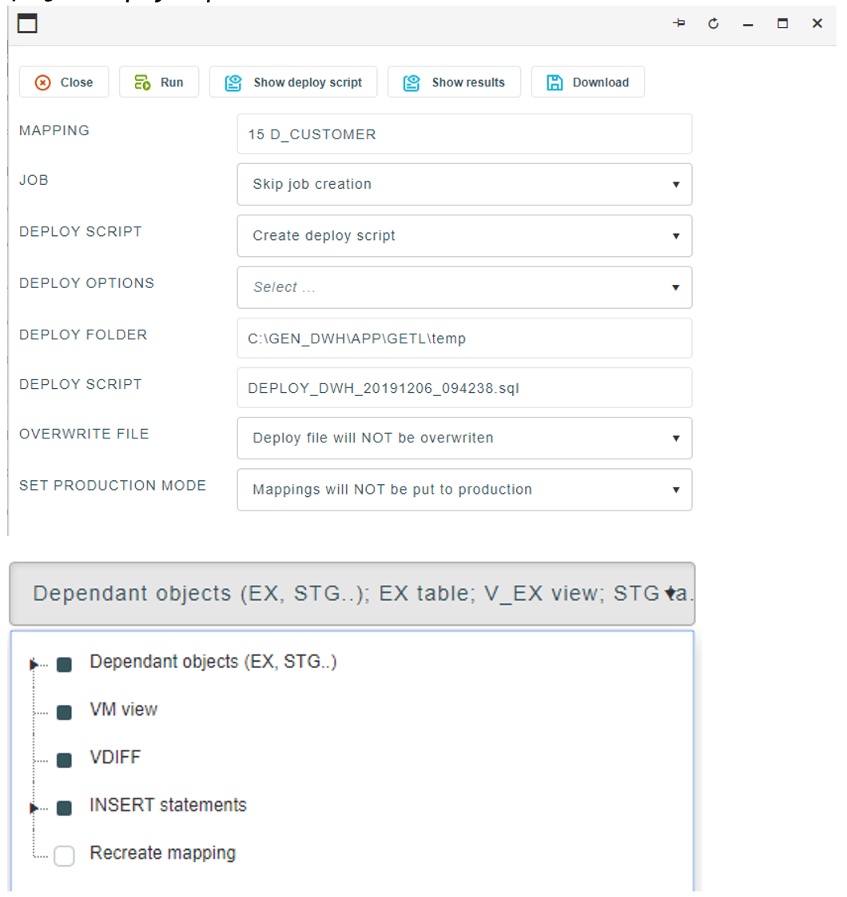

## Mappings toolbar

As we said before, mapping is a main document or object in Data Merlin, so is list of mappings a main form and it opens right after successful login. It is where we manage and perform operations over mappings, such as create, edit, delete, deploy and so on. 
Below, we will try to cover the most important features. Some of the options can be selected on one mapping specifically, while for others, we can mark multiple mappings, as shown on picture below.

#### 1. Create new

Opens an empty mapping details form, where we can create new mapping.

#### 2. Edit

Opens a mapping details form, where we can edit a mapping. In order to apply changes, we are making in our mappings, “Update” button needs to be clicked.

It is important to know, that mappings with PRODUCTION status (more on mapping statuses is covered below) have “Update” button enabled only for admin user.

#### 3. Delete

Deletes all selected mappings.

#### 4. Copy

Creates exact copy of a selected mapping. It should be noted, that only user defined attributes are copied to a new mapping and we still need to parse our SQL query and generate job, for object to be created. What exactly those two operations are, will be covered in sections below.

#### 5. Catalog

Shortcut to the tables catalog, where all imported tables are listed.

#### 6.	Lock/Unlock

Before an update of a mapping is made, application tries to lock it and fails if it has already been locked by other users. 
In case, when session was aborted, while working on a mapping, other users need to manually unlock it in order to use it. This is made by selecting a mapping or more of them and select unlock button. Same goes for manual locking.

#### 7.	Deploy and report

These options are a legacy and are used on older projects. They are about to be removed in following releases. Alternatives for them can be found in “Utils” dropdown menu, but we will cover this topic below.

#### 8. Folders

Every mapping has its location folder structure defined. With this option we can arrange the structure and see which mappings certain folder contains.

#### 9. Utils

##### 9.1. Generate&Load

##### 9.2	Deploy script

##### 9.3	Report folder

##### 9.4-9.13 DOPOLNI