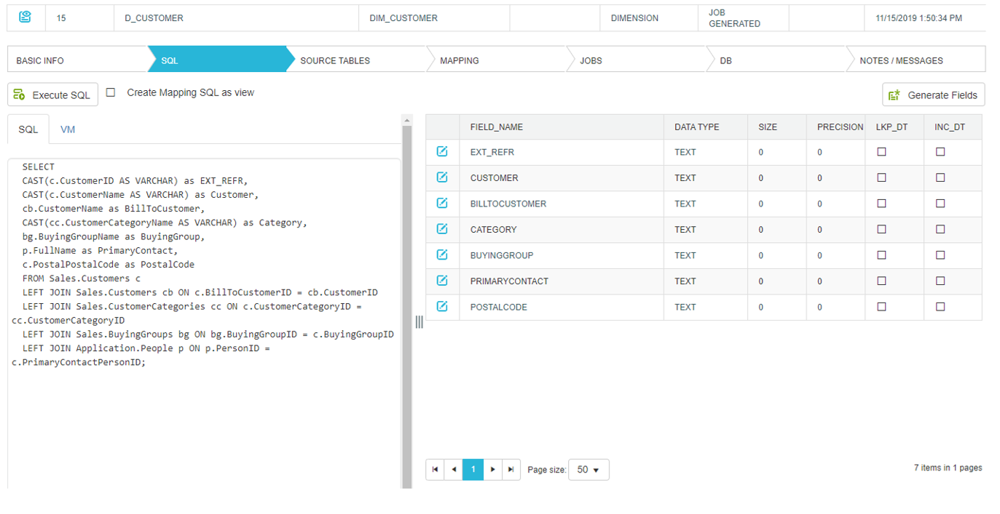
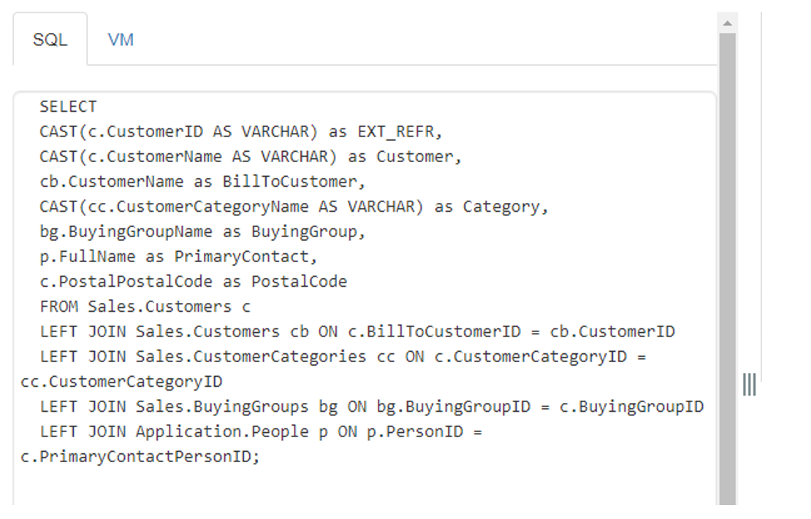
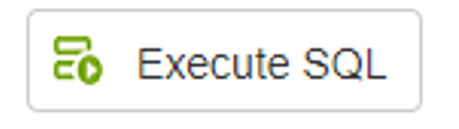
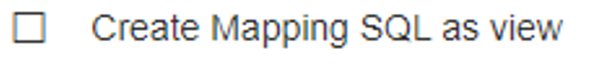
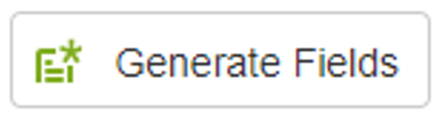
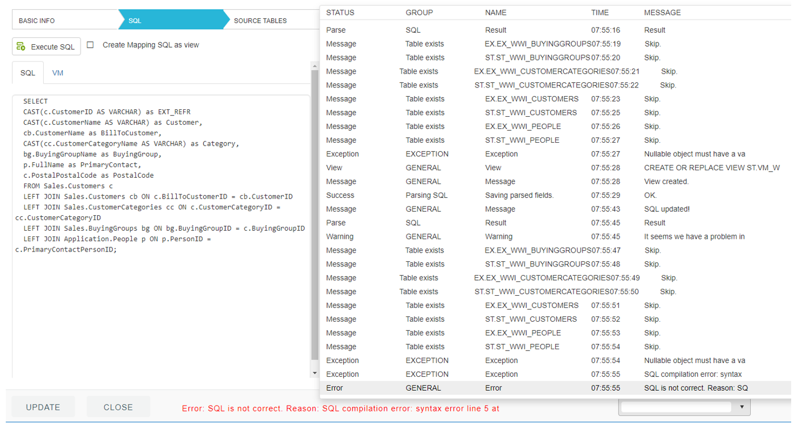
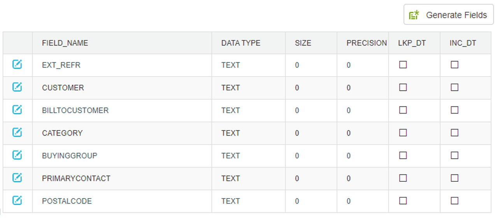

### SQL

Insert query and click on Generate fields. If query is ok (use just schema and table name, NOT DATABASE!). If query is ok, query fields will appear.

#### 1. SQL Editor

Here where we copy or write down our mapping SQL query. It is simply a query, which gives us desired data for our target table.
It is possible to extend the text editor, by clicking on three vertical lines button, between the editor and the list of fields.
Editor divides into SQL and VM tabs. The latter is generated automatically, when SQL query is parsed (by clicking “Generate fields” button- more on that is covered below). VM is a query that will be used, when populating dimensions or facts, so original source tables are replaced with the staged ones. 
Important to remember:
* If selecting from one source connection, which is also selected in basic info as a source database, tables should be defined only by their name or with added schema in front, if needed.
* 	When writing a federated query, which means we are using different source connections, for tables that don’t belong to the database selected as a source database in basic info, full path must be defined: *connection.schema.table*
* If query starts with WITH operator, option “Create mapping as SQL as view” must be selected. More on that option is covered below.
*	To maintain casing of object names, put them into quotation marks, like ‘MY_DB’.’dbo’.’MyTable’, otherwise it will be converted to: MY_DB.DBO.MYTABLE. Some database engines don’t have problems with that, while other could be unable to find object we defined.

#### 2. Execute SQL

We can always directly try our query and see what results we get. 

#### 3. Create mapping SQL as view

When job is created, our mapping SQL gets imported into what we call a DIFFERENTION VIEW or VD. If query don’t start with SELECT, importing in at as nested query can cause problems. If this option is selected, query gets packed into view first, then this view is imported into VD query. More on VD will be covered in section below.

#### 4. Generate fields

By clicking a “Generate fields” button, following steps are performed in the background:
*	Mapping SQL is parsed (used source tables are defined, query result fields are extracted)
*	Extract tables, stage tables and corresponding views for all source tables are created 
In case when ERROR occurs, whole stack is written at the bottom of the form. You can open it, by clicking dropdown control, right to the error message in red text:

#### 5. Fields list

List of source fields, that were parsed from our mapping SQL query. We will use them later in MAPPING tab, where they will be bound to target fields.
